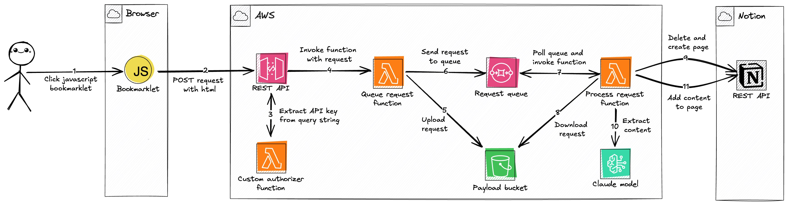

# Lambdalet.AI


Lambdalet.AI (*Lambda* + ~~bookmark~~*let*) is an AI-powered bookmarking and read-it-later service. It uses a dynamic javascript bookmark - a so called [bookmarklet](https://en.wikipedia.org/wiki/Bookmarklet) - to send the current page's HTML to an AWS Lambda function. The Lambda function invokes a Large Language Model on Bedrock to extract the page's main content - ignoring headers, footers and other non-content elements - and saves it to a Notion database. The Notion database stores all our bookmarks and allows us to find bookmarks by title, URL and even their content.

## Try It

You can try Lambdalet.AI without deploying anything. Follow these steps:

1.  **Open Notion Database**: Open the shared [Notion database](https://zirkelc.notion.site/20c00d5ef00e802a8cd1de77eafebc4f?v=20c00d5ef00e80c8adb5000cca955976) in a new tab. This is where all saved pages will appear.

2.  **Create Bookmarklet**: Create a new bookmark in your browser using the JavaScript code below as the URL.

    <details>
    <summary>JavaScript bookmarklet</summary>

    ```js
    javascript: (async () => {
      const apiKey = 'W76GK763928L8g8TcMdMU8Dw2rQ4EZwv3eqf4Yp0';
      const apiUrl = 'https://paip1r3t7j.execute-api.eu-west-1.amazonaws.com/prod/';
      const url = new URL(apiUrl);
      url.searchParams.set('apiKey', apiKey);

      async function fetchCSP() {
        try {
          const response = await fetch(window.location.href, { method: 'HEAD' });
          const cspHeader =
            response.headers.get('Content-Security-Policy') ||
            response.headers.get('Content-Security-Policy-Report-Only');

          if (!cspHeader) return null;

          const directives = {};
          cspHeader.split(';').forEach((directive) => {
            const [key, ...values] = directive.trim().split(/\s+/);
            if (key) {
              directives[key] = values;
            }
          });

          return directives;
        } catch (error) {
          console.warn('Lambdalet.AI: Failed to check CSP headers:', error);
          return null;
        }
      }

      function allowsFetch(directives) {
        if (!directives) return true;
        const connectSrc = directives['connect-src'];
        const allowsFetch =
          !connectSrc ||
          connectSrc.includes('*') ||
          connectSrc.some((src) => {
            if (src === "'self'") return false;
            if (src === "'none'") return false;

            const cleanSrc = src.replace(/\*/g, '');
            return (
              apiUrl.startsWith(cleanSrc) ||
              cleanSrc.includes(new URL(apiUrl).hostname)
            );
          });

        console.log('Lambdalet.AI: allowsFetch', allowsFetch, connectSrc);

        return allowsFetch;
      }

      function allowsFormAction(directives) {
        if (!directives) return true;
        const formAction = directives['form-action'];
        const allowsFormAction =
          !formAction ||
          formAction.includes('*') ||
          formAction.some((src) => {
            if (src === "'self'") return false;
            if (src === "'none'") return false;

            const cleanSrc = src.replace(/\*/g, '');
            return (
              apiUrl.startsWith(cleanSrc) ||
              cleanSrc.includes(new URL(apiUrl).hostname)
            );
          });
        console.log('Lambdalet.AI: allowsFormAction', allowsFormAction, formAction);
        return allowsFormAction;
      }

      function getSelectedHTML() {
        if (window.getSelection) {
          const selection = window.getSelection();
          if (selection.rangeCount) {
            const container = document.createElement('div');
            for (let i = 0; i < selection.rangeCount; ++i) {
              container.appendChild(selection.getRangeAt(i).cloneContents());
            }
            return container.innerHTML;
          }
        }
        if (document.selection && document.selection.type === 'Text') {
          return document.selection.createRange().htmlText;
        }

        return undefined;
      }

      async function tryFetch(data) {
        try {
          await fetch(url, {
            method: 'POST',
            body: new FormData({
              ...data,
              invoke: 'fetch',
            }),
          });
          return true;
        } catch (error) {
          console.warn('Lambdalet.AI: Fetch method failed:', error);
          return false;
        }
      }

      async function tryFormAction(data) {
        return new Promise((resolve) => {
          let hasCspViolation = false;
          document.addEventListener('securitypolicyviolation', () => {
            hasCspViolation = true;
            console.error('Lambdalet.AI: CSP violation detected');
          });

          const form = document.createElement('form');
          form.method = 'POST';
          form.action = url.toString();
          form.target = '_blank';
          document.body.appendChild(form);

          Object.entries({
            ...data,
            invoke: 'form-blank',
          }).forEach(([key, value]) => {
            const input = document.createElement('input');
            input.type = 'hidden';
            input.name = key;
            input.value = value;
            form.appendChild(input);
          });

          form.submit();
          document.body.removeChild(form);

          setTimeout(() => {
            if (hasCspViolation) {
              console.warn('Lambdalet.AI: Form action failed with CSP violation');
              resolve(false);
            } else {
              resolve(true);
            }
          }, 100);
        });
      }

      function tryWindowOpen(data) {
        Object.entries({ ...data, html: undefined, invoke: 'window-open' }).forEach(
          ([key, value]) => {
            if (value !== undefined) url.searchParams.set(key, value);
          },
        );

        const newWindow = window.open(url, '_blank');

        return !!newWindow;
      }

      const selectedHTML = getSelectedHTML();
      const hasSelection = !!selectedHTML;

      const data = {
        html: hasSelection ? selectedHTML : document.body.innerHTML,
        mode: hasSelection ? 'selection' : 'document',
        url: window.location.href,
        title: document.title,
      };

      const cspHeader = await fetchCSP();
      let success = false;

      if (allowsFetch(cspHeader)) {
        success = await tryFetch(data);
      }

      if (!success && allowsFormAction(cspHeader)) {
        success = await tryFormAction(data);
      }

      if (!success) {
        success = tryWindowOpen(data);
      }

      if (success) {
        alert(
          `Saved ${data.mode === 'selection' ? 'text selection' : 'full page'} to Lambdalet.AI`,
        );
      } else {
        alert('Could not save to Lambdalet.AI. See console for details.');
      }
    })();
    ```
    </details>

3.  **Find a Page**: Go to any web page you want to save, like this one on [Invoking a Lambda function using an Amazon API Gateway endpoint](https://docs.aws.amazon.com/lambda/latest/dg/services-apigateway.html). Note that requests are deduplicated by URL, so clicking the bookmarklet multiple times on the same page won't create duplicate entries.

4.  **Save Page**: Click the bookmarklet you just created. The bookmarklet runs in the context of the current page and the page's Content Security Policy (CSP) may block it. If this happens, the bookmarklet falls back to submitting a form in a new window which closes itself automatically.

5.  **Verify Result**: Check the Notion database. A new entry for your page will appear. Content extraction is asynchronous, so it might take a few moments for the content to show up, depending on the page size. The URL is the unique identifier for each page. If you save a page that already exists, its content will be updated.


| Full page  | Selection |
| ------------- | ------------- |
|   |   |
| Saves the full page to Notion and extracts the main content with an LLM while keeping the original structure (links, images, code, formatting) intact | Saves only the selected text to Notion without LLM while keeping the original structure (links, images, code, formatting) intact |

## Architecture



### Description

1.  **User Action**: The process begins when the user clicks a JavaScript **Bookmarklet** in their browser on a page they wish to save.

2.  **Data Submission**: The bookmarklet sends the page's HTML, URL, and title in a `POST` request to a **REST API** (API Gateway). To handle pages with a restrictive Content Security Policy (CSP) that might block `fetch`, the bookmarklet has a fallback that submits a form or opens a new temporary window.

3.  **Authorization**: The **REST API** uses a **Custom Authorizer Function** (Lambda) to validate the request by extracting an API key from the query string. Using the query string is necessary to support the form submission fallback, which doesn't allow custom HTTP headers.

4.  **Request Invocation**: After validating the API key against a usage plan, the **REST API** invokes a **Queue Request Function** (Lambda), forwarding the request payload.

5.  **Payload Offloading**: The **Queue Request Function** uploads the large payload (HTML, URL, and title) to a **Payload Bucket** (S3). This is done because the payload can exceed the 256KB limit for SQS messages. It uses a hash of the URL as the S3 object key for deterministic naming, preventing duplicate objects for the same page. 

6.  **Queueing for Process**: The function sends a message containing the S3 bucket and object key to a **Request Queue** (SQS). The queue used the URL for deduplication, so multiple clicks for the same URL do not create multiple processing jobs.

7.  **Asynchronous Invocation**: The **Request Queue** is configured with an event source mapping to trigger a **Process Request Function** (Lambda) for each new message. A batch size of 1 ensures that each function invocation handles a single request, which helps avoid timeouts when processing large pages.

8.  **Payload Retrieval**: The **Process Request Function** downloads the payload from the **Payload Bucket** (S3) using the key provided in the SQS message.

9.  **Notion Page Creation**: The function checks a Notion database for a page with the same URL. If a page exists, it is archived to avoid issues with Notion's API rate limits when deleting content block by block. A new Notion page is then created with the title and URL, and its status is set to "in progress".

10. **Main Content Extraction**: The **Process Request Function** converts the HTML to Markdown. If the payload is from a full page, it invokes **Claude 3.7 Sonnet** (Bedrock) to extract the main content from the Markdown. Using Markdown is more token-efficient than raw HTML. If the payload is from a user's text selection, the converted Markdown is used as the content directly.

11. **Finalization**: After receiving a response from the model, the **Process Request Function** appends the extracted content to the Notion page and sets the status to "done". If content extraction fails, the unconverted HTML-to-Markdown text is added to the page, and the status is set to "failed".


## Development

The following steps describe how you can set up your own instance of the app. An AWS account and Notion workspace are required.

1.  **Create Notion Integration**: Go to the [Notion integrations page](https://www.notion.so/profile/integrations) and create a new internal integration for your workspace. Note the internal integration secret. 

    Docs: [Create your integration in Notion](https://developers.notion.com/docs/create-a-notion-integration#create-your-integration-in-notion)

2.  **Create Notion Database**: Create a new full-page database within a Notion page. Note that you cannot create top-level databases in the Notion app, but you can move the database to the top level after creation if you prefer. The required database properties are created automatically on the first run. Note the database ID from its URL.

    [](https://developers.notion.com/reference/retrieve-a-database#:~:text=To%20find%20a%20database%20ID%2C%20navigate%20to%20the%20database%20URL%20in%20your%20Notion%20workspace.%20The%20ID%20is%20the%20string%20of%20characters%20in%20the%20URL%20that%20is%20between%20the%20slash%20following%20the%20workspace%20name%20(if%20applicable)%20and%20the%20question%20mark.%20The%20ID%20is%20a%2032%20characters%20alphanumeric%20string)
    Docs: [Where can I find my database's ID?](https://developers.notion.com/docs/working-with-databases#:~:text=Where%20can%20I%20find%20my%20database%27s%20ID%3F)

3.  **Enable Integration Access**: Share the database with your new integration by adding it as a connection in the Notion page's settings.

    [](https://developers.notion.com/docs/create-a-notion-integration#give-your-integration-page-permissions)

    Docs: [Give your integration page permissions](https://developers.notion.com/docs/create-a-notion-integration#give-your-integration-page-permissions)

4.  **Clone Project**: Clone the repository and install the dependencies.

    ```sh
    pnpm install
    ```

5.  **Update Environment Variables**: Rename the `.env.template` file to `.env` and add the `NOTION_TOKEN` and `NOTION_DATABASE_ID` you noted earlier.

    ```toml
    # .env
    NOTION_TOKEN="..."        # Internal integration secret
    NOTION_DATABASE_ID="..."  # Notion database ID
    ```

6.  **Deploy Project**: Run `cdk deploy` to deploy the project. Note the API URL and API key from the output.

    ```sh
    pnpm cdk deploy
    ```

7.  **Create Bookmarklet**: Create a new bookmark in your browser and use the code from [bookmarklet.js](./bookmarklets/bookmarklet.js) as URL. Replace the API URL and API key with the values from your deployment.

## Issues and Limitations

-   **Content Security Policy (CSP)**: The bookmarklet executes in the context of the current page. If the page has a restrictive CSP, the `fetch` call might be blocked. Check your browser's developer console for errors if the bookmarklet appears to do nothing.

-   **LLM Token Limits**: The application uses [Claude Sonnet 3.7](https://docs.anthropic.com/en/docs/about-claude/models/overview#model-comparison-table) for the main content extraction. This LLM has context window of 200K tokens (~150K words) and max output limit of 64K tokens (~48K words). If the pages' content is too long, the content might not fit into the context window or the output gets truncated.

-   **Notion API Rate Limits**: The Notion API has a rate limit of about three requests per second. It also limits requests to 100 block children and two levels of nesting at a time. The application handles these limits by splitting content into multiple requests, but very large pages may still encounter rate limiting.

## Future Ideas

-   **OpenGraph Metadata**: Extract OpenGraph metadata from the page and save it as properties on the Notion page.
-   **AI Summaries**: Create an AI-generated summary of the page's content.
-   **Pre-Bookmark Editing**: Allow editing content before saving it to the database.
-   **Step Functions**: Split the processing Lambda into a StepFunction state machine and use the Bedrock integration to extract the main content.
-   **Additional Integrations**: Add support for other applications like Obsidian or Roam Research.
