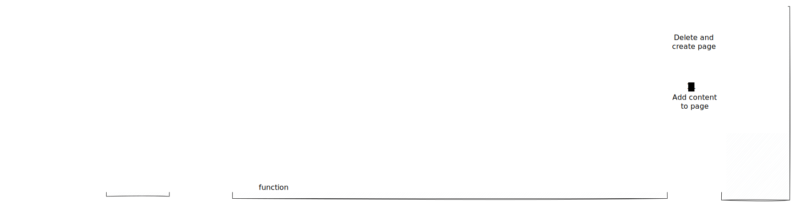

# Lambdalet.AI


## About
> Reinventing the bookmarklet.

Lambdalet.AI (*Lambda* + ~~bookmark~~*let*) is an AI-powered bookmarking and read-it-later service. It uses a bookmarklet to invoke an AWS Lambda function with a webpage's content. The function uses an LLM to extract the page's main content and saves it to a Notion database.

## Try It

You can try Lambdalet.AI without deploying anything. Follow these steps:

1. Open the shared [Notion database](https://www.notion.so/zirkelc/20c00d5ef00e802a8cd1de77eafebc4f?v=20c00d5ef00e80c8adb5000cca955976&p=20d00d5ef00e81029accc1ca2b4888d0&pm=s) in a new tab. This is where all saved pages will appear.

2. Create a new bookmark in your browser using the JavaScript code below as the URL.

    <details>
    <summary>JavaScript bookmarklet</summary>

    ```js
    javascript: (async () => {
      const apiKey = 'W76GK763928L8g8TcMdMU8Dw2rQ4EZwv3eqf4Yp0';
      const apiUrl = 'https://paip1r3t7j.execute-api.eu-west-1.amazonaws.com/prod/';
      const url = `${apiUrl}?apiKey=${apiKey}`;

      function getSelectedHTML() {
        if (window.getSelection) {
          const selection = window.getSelection();
          if (selection.rangeCount) {
            const container = document.createElement('div');
            for (let i = 0; i < selection.rangeCount; ++i) {
              container.appendChild(selection.getRangeAt(i).cloneContents());
            }
            return container.innerHTML;
          }
        }
        if (document.selection && document.selection.type === 'Text') {
          return document.selection.createRange().htmlText;
        }

        return undefined;
      }

      const selectedHTML = getSelectedHTML();
      const hasSelection = !!selectedHTML;

      const data = {
        html: hasSelection ? selectedHTML : document.body.innerHTML,
        mode: hasSelection ? 'selection' : 'document',
        url: window.location.href,
        title: document.title,
      };

      try {
        await fetch(url, {
          method: 'POST',
          body: new FormData({
            ...data,
            invoke: 'fetch',
          }),
        });
      } catch (error) {
        const form = document.createElement('form');
        form.method = 'POST';
        form.action = url;
        form.target = '_blank';
        document.body.appendChild(form);

        Object.entries({
          ...data,
          invoke: 'form-blank',
        }).forEach(([key, value]) => {
          const input = document.createElement('input');
          input.type = 'hidden';
          input.name = key;
          input.value = value;
          form.appendChild(input);
        });

        form.submit();

        document.body.removeChild(form);
      }
      alert(`Saved ${hasSelection ? 'text selection' : 'full page'} to Lambdalet.AI`);
    })();
    ```
    </details>

3. Go to any web page you want to save, like this one on [Invoking a Lambda function using an Amazon API Gateway endpoint](https://docs.aws.amazon.com/lambda/latest/dg/services-apigateway.html).

> [!NOTE]
> Requests are deduplicated by URL, so clicking the bookmarklet multiple times on the same page won't create duplicate entries.

4. Click the bookmarklet you just created.

> [!NOTE]
> The bookmarklet runs in the context of the current page. A page's Content Security Policy (CSP) may block it. If this happens, the bookmarklet falls back to submitting a form in a new window which closes itself automatically.

5. Check the Notion database. A new entry for your page will appear. Content extraction is asynchronous, so it might take a few moments for the content to show up, depending on the page size.

> [!NOTE]
> The URL is the unique identifier for each page. If you save a page that already exists, its content will be updated.


## Architecture



### Description

1. The user clicks the JavaScript **Bookmarklet** in the browser on a page she wants to bookmark.

2. The JavaScript bookmarklet sends a POST request with the current page's HTML, URL and title to the **REST API** (API Gateway). It first uses the `fetch` API to send the request. To handle pages with a restrictive Content Security Policy (CSP) that might block `fetch`, the bookmarklet has a fallback that submits a form in a temporary new window.

3. The **REST API** uses a **Custom authorizer function** to validate the request. The authorizer extracts an API key from the request's query string. An API key in the query string is required to support the form submission fallback, which does not allow setting custom HTTP headers like `x-api-key`.

4. The **REST API** validates the API key received from the **Custom authorizer** against a usage plan. If the API key is valid and usage is permitted, the **REST API** invokes the **Queue request function** (Lambda) with the HTTP request as payload.

5. The **Queue request function** parses the HTTP request and uploads the payload (HTML, URL and title) to the **Payload bucket** (S3), because the payload size can easily exceed the 256KB limit for SQS messages. The URL is hashed to create a short and deterministic key for the S3 object, so that subsequent requests for the same URL will not create multiple objects.

6. The **Queue request function** sends the S3 bucket and object key as a message to the **Request queue** (SQS). The queue deduplicates messages, so that multiple clicks on the bookmarklet for the same URL will not create multiple requests.

7. The **Request queue** is configured to trigger the **Process request function** (Lambda) for each new message. The event source mapping uses a batch size of 1, ensuring each function invocation handles a single request. This helps avoid timeouts when processing large pages.

8. The **Process request function** downloads the payload (HTML, URL and title) from the **Payload bucket** (S3) using the key from the SQS message.

9. The **Process request function** checks the Notion database for a page with the same URL. If a page exists, it's archived. This prevents issues with Notion's API rate limits that can occur when deleting a page's content block by block. A new Notion page is then created with the title and URL, and its status is set to "in progress".

10. Then the **Process request function** converts the HTML to markdown. If the HTML is a full page, it invokes **Claude 3.7 Sonnet** (Bedrock) with the markdown to extract the main content. The model is called with markdown instead of HTML due to token limits. In case the HTML comes from a text selection, the converted markdown will be used as content.

11. After receiving the response from the model, the **Process request function** appends the extracted content to the Notion page and sets the status to "done". If content extraction fails, the raw HTML-to-markdown conversion is added to the page and the status is set to "failed".


## Development
The following steps describe how you can set up your own instance of the app. An AWS account and Notion workspace are required.

1. **Create an internal Notion integration**

    Go to the [Notion integrations page](https://www.notion.so/profile/integrations) and create a new internal integration for your workspace. Note the internal integration secret. See [Create your integration in Notion](https://developers.notion.com/docs/create-a-notion-integration#create-your-integration-in-notion) for more details.

2. **Create a Notion page and database**

    Create a new full-page database within a Notion page. Note that you cannot create top-level databases in the Notion app, but you can move the database to the top level after creation if you prefer. The required database properties are created automatically on the first run. Note the database ID from its URL.

    [](https://developers.notion.com/reference/retrieve-a-database#:~:text=To%20find%20a%20database%20ID%2C%20navigate%20to%20the%20database%20URL%20in%20your%20Notion%20workspace.%20The%20ID%20is%20the%20string%20of%20characters%20in%20the%20URL%20that%20is%20between%20the%20slash%20following%20the%20workspace%20name%20(if%20applicable)%20and%20the%20question%20mark.%20The%20ID%20is%20a%2032%20characters%20alphanumeric%20string)

3. **Enable access for internal integration**

    Share the database with your new integration by adding it as a connection in the Notion page's settings.
    See [Give your integration page permissions](https://developers.notion.com/docs/create-a-notion-integration#give-your-integration-page-permissions) for more details.

    [](https://developers.notion.com/docs/create-a-notion-integration#give-your-integration-page-permissions)

4. **Clone project**

    Clone the repository and install the dependencies.

    ```bash
    pnpm install
    ```

5. **Environment variables**

    Rename the `.env.template` file to `.env` and add the `NOTION_TOKEN` and `NOTION_DATABASE_ID` you noted earlier.

6. **Deploy project**

    Run the `deploy` script to deploy the project. Note the API URL and API key from the output.

    ```bash
    pnpm deploy
    ```

7. **Create a bookmarklet**

    Create a new bookmarklet using the code from the [Try It](#try-it) section as a template. Replace the API URL and API key with the values from your deployment. 


## Issues and Limitations

- **Content Security Policy (CSP)**: The bookmarklet executes in the context of the current page. If the page has a restrictive CSP, the `fetch` call might be blocked. Check your browser's developer console for errors if the bookmarklet appears to do nothing.

- **LLM input/output token limit**: The application uses [Claude Sonnet 3.7](https://docs.anthropic.com/en/docs/about-claude/models/overview#model-comparison-table) for the main content extraction. This LLM has context window of 200K tokens (~150K words) and max output limit of 64K tokens (~48K words). If the pages' content is too long, the content might not fit into the context window or the output gets truncated.

- **Notion API Limits**: The Notion API has a rate limit of about three requests per second. It also limits requests to 100 block children and two levels of nesting at a time. The application handles these limits by splitting content into multiple requests, but very large pages may still encounter rate limiting.

## Future Ideas

- Extract OpenGraph metadata from the page and save it as properties on the Notion page.
- Create an AI-generated summary of the page's content.
- Allow editing content before saving it to the database.
- Add support for other applications like Obsidian or Roam Research.